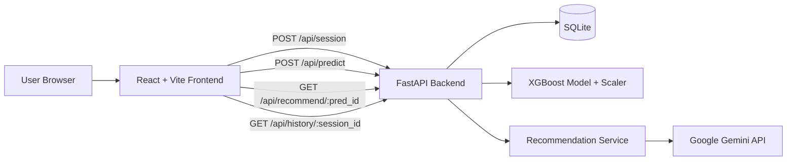

# Mindscan AI

> Nen tang khao sat va goi y suc khoe tam than cho sinh vien, ket hop FastAPI + React + XGBoost + Gemini.


## Muc Luc

- [Tong Quan](#tong-quan)
- [Kien Truc He Thong](#kien-truc-he-thong)
- [Cong Nghe Su Dung](#cong-nghe-su-dung)
- [Cau Truc Thu Muc](#cau-truc-thu-muc)
- [Quick Start Checklist](#quick-start-checklist)
- [API Endpoints](#api-endpoints)
- [Bien Moi Truong](#bien-moi-truong)
- [ML Pipeline](#ml-pipeline)
- [Troubleshooting va FAQ](#troubleshooting-va-faq)

---

## Tong Quan

Mindscan AI la he thong full-stack giup:

- Thu thap du lieu khao sat an danh tu sinh vien
- Du doan muc do stress bang mo hinh XGBoost
- Sinh khuyen nghi ca nhan hoa bang rule engine + Gemini
- Hien thi dashboard xu huong stress va cac chi so lien quan

### Tinh nang noi bat

- Ho tro da ngon ngu: VI, EN, DE, ZH, FR
- Khao sat an danh, khong thu thap danh tinh ca nhan
- Dashboard phan tich va lich su session
- API docs san co qua Swagger va ReDoc

---

## Kien Truc He Thong



> Frontend va backend mac dinh chay o `localhost:3000` va `localhost:8080`.

---

## Cong Nghe Su Dung

| Layer | Stack |
|---|---|
| Frontend | React 19, TypeScript, Vite 6, Tailwind CSS v4 |
| UI/Charts | Lucide React, Recharts, Motion |
| Backend | Python, FastAPI, Uvicorn |
| Database | SQLite, SQLAlchemy async, aiosqlite |
| Machine Learning | XGBoost, scikit-learn, pandas, joblib |
| Auth (Admin) | JWT (PyJWT) |
| AI Service | Google Gemini API (`@google/genai`) |

---

## Cau Truc Thu Muc

```text
mindscan-ai/
|-- backend/
|   |-- main.py
|   |-- database.py
|   |-- models.py
|   |-- schemas.py
|   |-- auth.py
|   |-- requirements.txt
|   |-- routers/
|   |   |-- user.py
|   |   `-- admin.py
|   `-- services/
|       |-- ml_service.py
|       `-- recommendation_service.py
|-- src/
|   |-- App.tsx
|   |-- translations.ts
|   |-- main.tsx
|   |-- index.css
|   `-- services/
|       `-- geminiService.ts
|-- scaler.pkl
|-- xgboost_stress_model.pkl
|-- mindscan_ai.db
|-- package.json
|-- vite.config.ts
`-- README.md
```

---

## Quick Start Checklist

> Muc tieu: copy-paste la chay duoc local.

### 0) Prerequisites

- Python >= 3.10
- Node.js >= 18
- npm >= 9

### 1) Clone va cai dat backend

```bash
# tu root project
python -m venv venv

# Windows PowerShell
.\venv\Scripts\Activate.ps1

# Windows CMD
# .\venv\Scripts\activate.bat

# macOS / Linux
# source venv/bin/activate

pip install -r backend/requirements.txt
```

Copy file mau backend env:

```bash
copy backend/.env.example backend/.env
```

Hoac tao thu cong `backend/.env`:

```env
DATABASE_URL=sqlite+aiosqlite:///./mindscan_ai.db
JWT_SECRET_KEY=your-super-secret-key-here
```

> JWT_SECRET_KEY la bat buoc. Backend se fail-fast neu bien nay khong duoc set.

Chay migration DB:

```bash
alembic upgrade head
```

Neu ban da co database cu duoc tao boi `create_all` truoc day, hay dong bo version truoc:

```bash
alembic stamp head
```

Chay backend:

```bash
uvicorn backend.main:app --port 8080 --reload
```

### 2) Cai dat va chay frontend

```bash
# mo terminal moi tai root project
npm install
```

Tao file `.env` (frontend):

```env
VITE_GEMINI_API_KEY=your-gemini-api-key-here
```

Chay frontend:

```bash
npm run dev
```

### 3) Verify nhanh

- Frontend: http://localhost:3000
- Backend root: http://localhost:8080
- Swagger: http://localhost:8080/docs
- ReDoc: http://localhost:8080/redoc

---

## API Endpoints

### Public/User APIs

| Method | Endpoint | Mo ta |
|---|---|---|
| `POST` | `/api/session` | Tao session an danh |
| `POST` | `/api/predict?session_id=...` | Nhan du lieu khao sat, tra ve stress prediction |
| `GET` | `/api/recommend/{pred_id}` | Lay danh sach khuyen nghi |
| `GET` | `/api/history/{session_id}` | Lay lich su prediction theo session |

### Admin APIs (JWT required)

| Method | Endpoint | Mo ta |
|---|---|---|
| `GET` | `/api/admin/stats` | Tong hop thong ke he thong |
| `GET` | `/api/admin/export` | Export du lieu CSV |

> Tai lieu tuong tac day du co tai `http://localhost:8080/docs` khi backend dang chay.

---

## Bien Moi Truong

### Backend (`backend/.env`)

| Variable | Required | Description | Example |
|---|---|---|---|
| `DATABASE_URL` | Yes | SQLAlchemy async connection string | `sqlite+aiosqlite:///./mindscan_ai.db` |
| `JWT_SECRET_KEY` | Yes | Secret key de ky JWT admin token | `replace-with-strong-random-string` |

### Frontend (`.env`)

| Variable | Required | Description |
|---|---|---|
| `VITE_GEMINI_API_KEY` | No | API key cho Gemini; de trong thi app van chay voi backend logic |

---

## ML Pipeline

1. User submit survey (20 features)
2. Backend map input theo schema huan luyen
3. Standardize bang `scaler.pkl`
4. Predict bang `xgboost_stress_model.pkl`
5. Tra ve `stress_level`, `confidence` va recommendation

---

## Troubleshooting va FAQ

<details>
<summary><strong>Troubleshooting (click de mo)</strong></summary>

| Trieu chung | Nguyen nhan thuong gap | Cach xu ly nhanh |
|---|---|---|
| CORS error tren browser | Origin frontend chua duoc allow | Kiem tra CORS config trong `backend/main.py` |
| `503 Service Unavailable` tai `/api/predict` | Thieu file model/scaler | Dam bao `xgboost_stress_model.pkl` va `scaler.pkl` o root |
| `ModuleNotFoundError` khi chay uvicorn | Chua active venv hoac chay sai thu muc | Active venv va chay lenh tu root project |
| Frontend khong goi duoc backend | Backend chua run hoac sai port | Chay backend o `8080`, kiem tra URL frontend |
| `422 Unprocessable Entity` | Payload survey sai schema | So khop data gui voi Pydantic schema |

</details>

<details>
<summary><strong>FAQ (click de mo)</strong></summary>

### Co can Gemini API key de chay local khong?

Khong bat buoc. Neu khong co key, app van co the chay phan backend prediction/recommendation co ban.

### Co nen commit file `.env` khong?

Khong. Luon them `.env` vao `.gitignore`.

### Frontend cua toi chay o cong 3001 thay vi 3000?

Do cong 3000 dang bi chiem. Vite se tu dong fallback sang cong khac.

</details>

---

## Notes cho contributor

> Khi mo PR, vui long cap nhat README neu thay doi endpoint, env var, hoac setup flow.

Built with care for student mental wellbeing.
